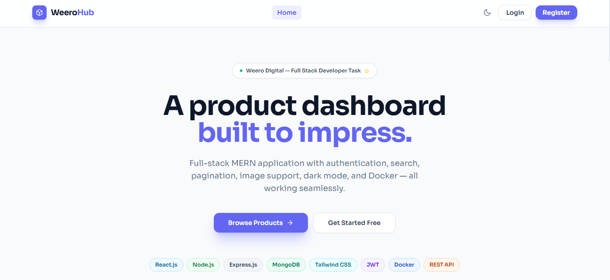
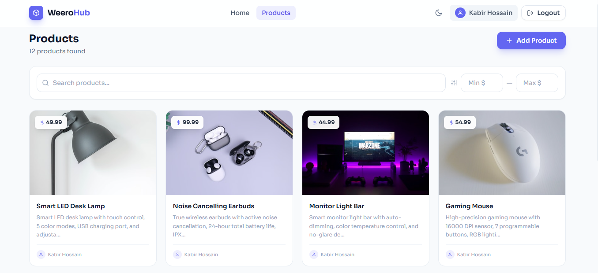
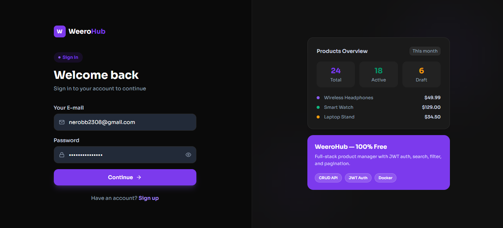

# WeeroHub — Product Management App

A full-stack web application where users can add, view, update, and delete products. Built as part of the Full Stack Developer Intern practical task for Weero Digital.

## Live Demo

- **Frontend:** https://weero-product-app.vercel.app
- **Backend API:** https://weero-backend.onrender.com

---

## Screenshots

### Home Page


### Products Page


### Dark Mode


---

## Features

**Core**
- Add, view, update, and delete products
- Product form with name, price, image URL, and description
- Responsive product grid layout
- Loading skeletons and error handling throughout

**Bonus**
- JWT-based authentication (Register & Login)
- Protected routes — only logged-in users can add/edit/delete
- Owner-only edit and delete — users can only manage their own products
- Real-time search by product name
- Price range filter (min / max)
- Server-side pagination
- Image URL with live preview
- Dark and light mode
- Docker support

---

## Tech Stack

| Layer | Technology |
|---|---|
| Frontend | React.js, Tailwind CSS, React Router v6 |
| State & Data | Context API, useReducer, Axios |
| Backend | Node.js, Express.js |
| Auth | JSON Web Token (JWT), bcryptjs |
| Database | MongoDB Atlas, Mongoose |
| Validation | express-validator |
| DevOps | Docker, Docker Compose |
| Deployment | Vercel (frontend), Render (backend) |

---

## Project Structure

```
weero-product-app/
├── backend/
│   ├── src/
│   │   ├── controllers/       # Business logic
│   │   │   ├── authController.js
│   │   │   └── productController.js
│   │   ├── models/            # Mongoose schemas
│   │   │   ├── User.js
│   │   │   └── Product.js
│   │   ├── routes/            # API routes
│   │   │   ├── authRoutes.js
│   │   │   └── productRoutes.js
│   │   ├── middleware/        # Auth, error handling
│   │   │   ├── authMiddleware.js
│   │   │   └── errorMiddleware.js
│   │   └── config/
│   │       └── db.js
│   ├── Dockerfile
│   ├── .env.example
│   └── server.js
├── frontend/
│   ├── src/
│   │   ├── components/        # Reusable UI components
│   │   ├── pages/             # Route-level pages
│   │   ├── context/           # Auth & Theme context
│   │   ├── hooks/             # Custom hooks
│   │   └── utils/             # Axios instance
│   └── Dockerfile
├── docker-compose.yml
└── README.md
```

---

## API Endpoints

| Method | Endpoint | Description | Auth Required |
|---|---|---|---|
| POST | /api/auth/register | Register new user | No |
| POST | /api/auth/login | Login user | No |
| GET | /api/auth/me | Get current user | Yes |
| GET | /api/products | Get all products (search, filter, paginate) | No |
| GET | /api/products/:id | Get single product | No |
| POST | /api/products | Create product | Yes |
| PUT | /api/products/:id | Update product | Yes (owner only) |
| DELETE | /api/products/:id | Delete product | Yes (owner only) |

---

## Getting Started

### Option 1 — Docker (Recommended)

Make sure [Docker Desktop](https://www.docker.com/products/docker-desktop/) is installed.

```bash
git clone https://github.com/nerobkabir/weero-product-app.git
cd weero-product-app
docker-compose up --build
```

- Frontend → http://localhost:3000
- Backend → http://localhost:5000

To stop:
```bash
docker-compose down
```

---

### Option 2 — Manual Setup

**Clone the repo**
```bash
git clone https://github.com/nerobkabir/weero-product-app.git
cd weero-product-app
```

**Backend**
```bash
cd backend
npm install
cp .env.example .env
```

Fill in your `.env`:
```
PORT=5000
MONGODB_URI=your_mongodb_atlas_uri
JWT_SECRET=your_jwt_secret_key
JWT_EXPIRE=30d
NODE_ENV=development
CLIENT_URL=http://localhost:3000
```

```bash
npm run dev
```

**Frontend**
```bash
cd ../frontend
npm install
```

Create `frontend/.env`:
```
REACT_APP_API_URL=http://localhost:5000/api
```

```bash
npm start
```

---

## Environment Variables

See `backend/.env.example`:

```
PORT=5000
MONGODB_URI=your_mongodb_uri_here
JWT_SECRET=your_secret_key_here
JWT_EXPIRE=30d
NODE_ENV=development
CLIENT_URL=http://localhost:3000
```

---

## Author

**Kabir Hossain**
GitHub: [@nerobkabir](https://github.com/nerobkabir)
Email: nerob2308@gmail.com